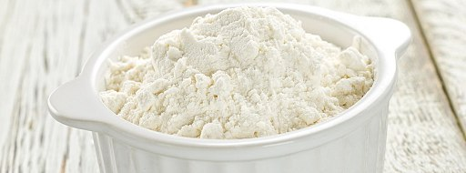

---
title: "Recept"
date: 2018-04-25T17:32:23+02:00
draft: false
---

## Světlý chléb bez lepku

Recept na světlý bezlepkový chéb pečený v domácí pekárně.

Ingredience:

* 600g bezlepkové mouky např.: Jizerky
* 500ml vlažné vody
* 20g droždí
* 1 lžička cukru
* 2 lžíce oleje
* 1 lžíce octa
* 1 lžička soli
* 1 lžička kmínu

Postup:

Vlažnou vodu nalijeme do formy na pečení. Rozdrobíme droždí. Přidáme lžičku cukru. Nasypeme rovnoměrně mouku. Na ni nasypeme lžičku soli a přidáme ocet a olej. Formu vložíme do domácí pekárny a pečeme na režim Bezlepkové pečení nebo minimálně 2 hodiny a 30 minut. Po upečení chléb vyjmeme z formy a necháme vychladnout.

Můžeme přidat i další koření např.: fenykl. Také můžeme přidat semínka.
